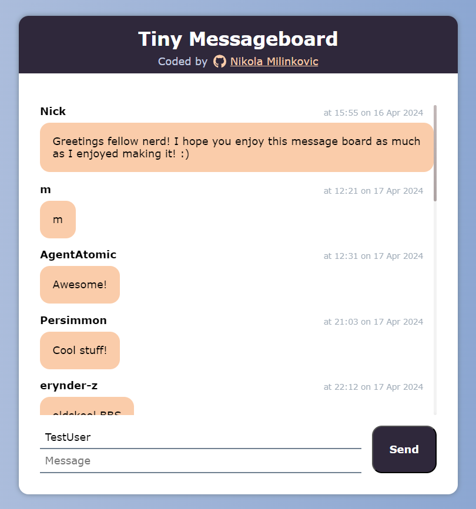

# Tiny Message Board
Small message board available to every user without registration. 
Made with Node.js and Express framework. 
MongoDB is used to store data and EJS to render views. 
Leave your thoughts and best wishes at the link bellow!

[Live Demo](https://tiny-message-board.adaptable.app/) ✨

**🧭 Possible Future Implementations**
- Refresh messages on certain intervals

## 💻 Built With

